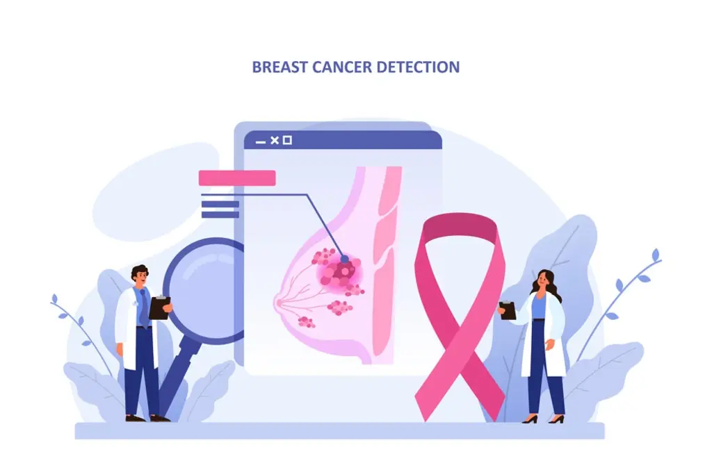

# Breast Cancer Detection



## 📋 Problem Statement

Breast cancer is the most common form of cancer among women. Early detection is crucial for effective treatment and survival. This project aims to develop a high-performing deep learning model capable of detecting the presence of cancer from medical images.

---

## 🎯 Objectives

- Implement state-of-the-art deep learning models for breast cancer detection using medical imaging datasets.
- Enhance performance through transfer learning with architectures such as ResNet and DenseNet.
- Integrate U-Net for precise lesion segmentation.
- Ensure reproducibility and efficient experiment tracking with MLflow.
- Deploy the project using Docker for portability and ease of use.
- Provide an interactive Streamlit interface for image upload and real-time prediction visualization.

---

## 📦 Dataset

This project uses a publicly available breast cancer imaging dataset accessible at [data.mendeley.com/public-files/datasets/k4t7msnt3y/files/f0bf474c-91cf-4db7-85b0-2273569a7b59/file_downloaded](https://data.mendeley.com/public-files/datasets/k4t7msnt3y/files/f0bf474c-91cf-4db7-85b0-2273569a7b59/file_downloaded).

---

## 🧠 Approach

- Utilization of transfer learning with ResNet or DenseNet to improve model accuracy and generalization.
- Incorporation of U-Net architecture for precise segmentation of lesions and region-of-interest extraction.
- End-to-end experiment workflow tracked with MLflow, including hyperparameter tuning and artifact logging.
- Containerized deployment using Docker for reproducibility and simple setup.
- User-friendly Streamlit app for easy image uploads and prediction visualization by clinicians and researchers.

---

## 🧩 Features

- **ETL Pipeline**: Automated image loading, preprocessing, and augmentation
- **Multiple Model Architectures**: EfficientNet B3, ResNet50, MobileNet V3, U-Net
- **MLflow Integration**: Experiment tracking, model versioning, and artifact management
- **Streamlit Interface**: Professional web UI for predictions
- **FastAPI Server**: REST API for model serving
- **Docker Deployment**: Complete containerization and orchestration
- **CI/CD Pipeline**: GitHub Actions for automated testing and deployment

---

## 📁 Project Structure

```
breast-cancer-detection/
├── src/
│   ├── config.py                       # Configuration management
│   ├── etl/
│   │   ├── download_dataset.py         # Data loading
│   │   ├── index_images_and_labels.py  # Mapping images and labels
│   │   ├── preprocess_images_split.py  # Preprocessing and normalization
│   │   └── __init__.py
│   ├── models/
│   │   ├── base_model.py               # Base model class
│   │   ├── training.py                 # Training with MLflow
│   │   └── __init__.py
│   ├── evaluation/
│   │   ├── metrics.py                  # Evaluation metrics
│   │   ├── visualization.py            # Metrics visualization
│   │   └── __init__.py
│   ├── streamlit/                      # Streamlit application                
│   └── api/
│       ├── main.py                     # FastAPI server
│       └── __init__.py
├── scripts/
│   ├── deploy.sh                       # Deployment script
├── data/
│   ├── raw/                            # Raw data
│   └── processed/                      # Processed data
├── models/                             # Trained models
├── mlruns/                             # MLflow experiments
├── pyproject.toml                      # Project configuration
├── Dockerfile                          # Development Docker image
├── Dockerfile.prod                     # Production Docker image
├── docker-compose.yml                  # Docker Compose
├── Makefile                            # Development commands
└── tests/
```

Streamlit Application Structure

```
src/streamlit_app/
├── __init__.py
├── main.py                              # Main entry point
├── config.py                            # Configuration & styling
│
├── components/
│   ├── __init__.py
│   ├── header.py                        # Header component
│   └── sidebar.py                       # Sidebar with model selection
│
├── custom_pages/
│   ├── __init__.py
│   ├── prediction.py                    # Prediction page
│   ├── mlflow_history.py                # History MLflow page
│   ├── monitoring.py                    # Monitoring page
│   ├── metrics.py                       # Metrics page
│   └── history.py                       # History page
│
├── utils/
│   ├── __init__.py
│   ├── image_processing.py               # Image processing function tools
│   └── visualization.py                  # Visualization function tools 
|                    
└── services/
    ├── __init__.py
    ├── storage_services.py               # Storage service logic
    └── prediction_service.py             # Prediction service logic
```
---

## 🚀 Getting Started

### ⚙️ Prerequisites

- Python 3.10+
- uv or virtualenv
- Docker & Docker Compose (optional)
- MLflow (for experiment tracking)
- Streamlit (for web app interface)
- TensorFlow, Keras, NumPy, Pandas, etc.

### 🖥️ Setup

#### Using uv

Installing uv (if necessary):

```bash
curl -LsSf https://astral.sh/uv/install.sh | sh
```

Create a virtual environment and install dependencies:

```bash
uv venv
```

Activate the virtual environment:

On Linux and macOS:

```bash
source .venv/bin/activate
```

On Windows:

```bash
.venv\Scripts\activate
```

Install dependencies:

```bash
uv pip install -r pyproject.toml
```

### 🖥️ Setup Environment variables

```bash
cp env.example .env
```

Edit ".env" file if needed

---

## ✨ Contributing

1. Fork the repository
2. Create a new branch (`git checkout -b feature/your-feature`)
3. Make your changes
4. Commit your changes (`git commit -am 'Add some feature'`)
5. Push to the branch (`git push origin feature/your-feature`)
6. Create a new Pull Request

---

## 📄 License

This project is under the **MIT License**. See [LICENSE](LICENSE) for more details.

---

## 👤 Author

**Jean-Michel LIEVIN**  
Data Scientist | Full-Stack Developer

- 🌐 Portfolio: [github.com/tabodino](https://github.com/tabodino)
- 💼 LinkedIn: [linkedin.com/in/jean-michel-lievin-247591143](https://www.linkedin.com/in/jean-michel-lievin-247591143)
- 📧 Email: [jeanmichel.liev1@gmail.com](mailto:jeanmichel.liev1@gmail.com)

---

## 🛠️ Support

For issues and questions, open an issue on GitHub.

[](mailto:jeanmichel.liev1@gmail.com)
[](https://github.com/tabodino/breast-cancer-detection/issues)